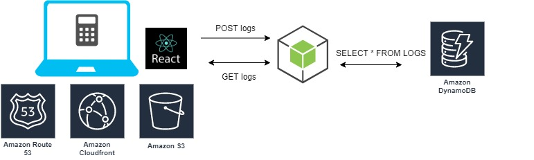

# simpleCalc

### Features

- Currently four functions can be performed: +, -, * and /
- The 'C' (reset) button must be used before moving on to the next calculation
- The last 10 calculations are right under the calculator which are updated if another user performs a valid calculation

### Local Clone

To run the app locally, clone the repository and cd into the directory from your CLI and run the following commands:

`npm install` followed by `npm start`

### Design

[Click here](https://www.jubairmr9.com) to go to the live site.
Or navigate to - www.jubairmr9.com

### Behind the Scenes

- The code is written in React.js in the front-end
- The code is compiled with npm
- The calculations takes place in an AWS Lambda function that uses a POST method to post the results to a DynamoDB table
- Another Lambda function fetches uses a GET method to pull data from the DynamoDB table to display in the UI
- The source code acceses the lambda functions through their API endpoint which have been configured to handle the requests
- The source code is then created into a production build using `npm build`
- The contents of the resulting 'build' directory is then uploaded into a S3 bucket in AWS which is then accessed via CloudFront through Route 53 at www.jubairmr9.com

### Future Scopes
- Add a full range of functionality
- Add proper design for the logs
